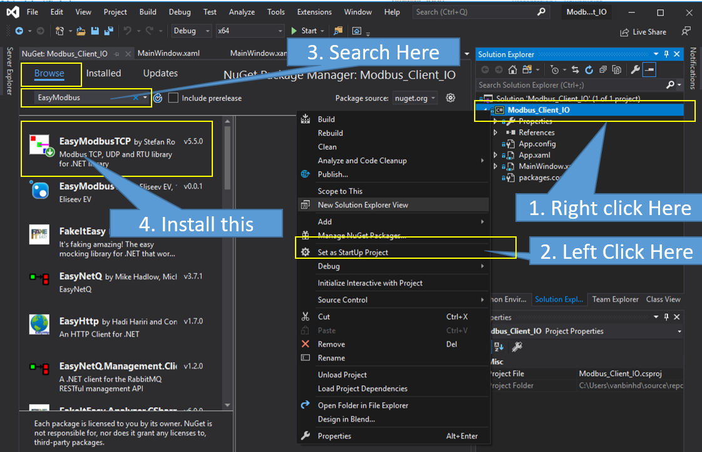
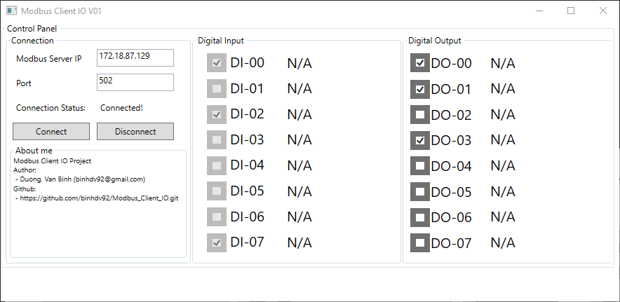
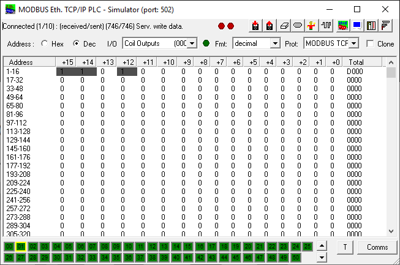
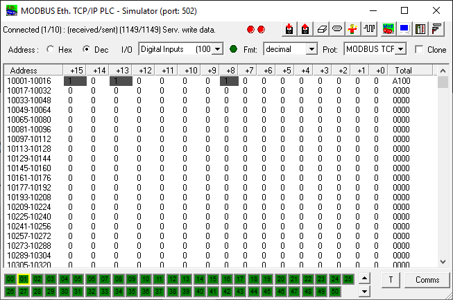

# Modbus_Client_IO

# Introduction
- This project aim to create a software is working as a Modbus Client protocol run on Windows environment.

# How to use
1. Clone this project.
> $ git clone https://github.com/binhdv92/Modbus_Client_IO.git

2. Open **Modbus_Client_IO.sln** by Visual Studio (I used the version of Visual Studio 2019)
3. Check or install the EasyModbusTCP library package on NuGet as below:

4. Click **Build** or press ** Ctrl+Shift+B** to build the solution on Visual Studio.

# Enjoin the result
1. the main window software will be like below when you build success.

2. I used a [Free Modbus PLC Simulator](http://www.plcsimulator.org/) to simulate a modbus on exactly my laptop to communnicate with this project.
 - Digital Input at simulator:

 - Digital Output at simulator:

# Reference
- [THE STANDARD LIBRARY FOR MODBUS COMMUNICATION](http://easymodbustcp.net/en/)
- [a Free Modbus PLC Simulator](http://www.plcsimulator.org/)

